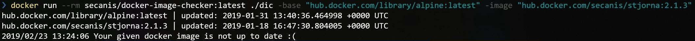

# Docker Image Checker

With this tool (called dic) you can check a given Docker image vs a base image.
This, in go lang written tool, compares the latest build timestamps on any Docker repository.



## Use Case

Normally you have an application Docker build on top of a base image like Alpine.
I use very often the `latest` tag for my apps, because I do not have any critical dependencies on the underlying OS.
So I will get to everytime the latest patched base image for my application.
The Docker Image Checker supports me to detect in my CI/CD pipeline a newer base image and can trigger a new release or a rebuild of an existent image.

## Usage

You can use a prepared Docker image on Docker Hub [https://hub.docker.com/r/secanis/docker-image-checker](https://hub.docker.com/r/secanis/docker-image-checker):

```bash
    docker pull secanis/docker-image-checker:latest
    docker run --rm secanis/docker-image-checker:latest \
        ./dic -base "hub.docker.com/library/alpine:latest" -image "hub.docker.com/secanis/stjorna:2.1.3"
```

Or when you want to use it in a CI/CD pipeline, you can do something like this:

```bash
    if docker run --rm secanis/docker-image-checker:latest \
            ./dic -base "hub.docker.com/library/alpine:latest" \
            -image "hub.docker.com/secanis/stjorna:2.1.3"; then
        # do something in your pipeline
        echo "Command succeeded"
    else
        # do something in your pipeline
        echo "Command failed"
    fi
```

Download the binary from Github [https://github.com/secanis/docker-image-checker/releases](https://github.com/secanis/docker-image-checker/releases) and unpack it.

```bash
    ./dic -base "hub.docker.com/library/alpine:latest" -image "hub.docker.com/secanis/stjorna:2.1.3"
```